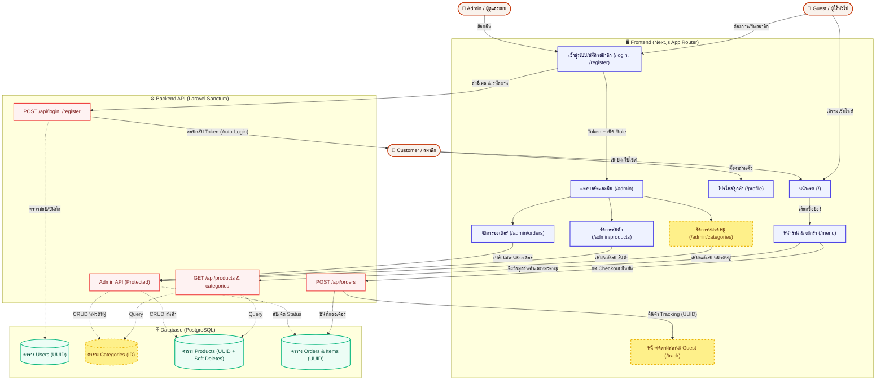

# 🗺️ Project Flow & Roadmap: SweetTooth (Monorepo)

## 📌 Architecture & System Workflow
This diagram represents the current production-ready workflow of the system, including both the Frontend (Next.js) and Backend (Laravel) interactions.

## 📌 Phase 1: Foundation (✅ เสร็จสิ้น)
- [x] Setup Monorepo (Next.js + Laravel 11).
- [x] สร้าง UI หน้าบ้านด้วย Next.js และจัดการ State ตะกร้าสินค้า.
- [x] สร้าง Backend API พื้นฐาน (ตาราง Products, Orders).
- [x] เชื่อมต่อหน้าบ้านและหลังบ้าน (ยิง API ดึงสินค้า และบันทึกคำสั่งซื้อ).

## 📌 Phase 2: Database Refactoring (✅ เสร็จสิ้น)
- [x] อัปเกรด Database Schema ตาม ERD ล่าสุด (เปลี่ยนใช้ UUID).
- [x] เพิ่มระบบ Soft Delete ในตาราง `products`.
- [x] เตรียมฟิลด์ `role`, `provider`, `provider_id` ในตาราง `users` สำหรับระบบ Login.

## 📌 Phase 3: API Testing & Authentication (✅ เสร็จสิ้น)
- [x] Setup Bruno Collection ในโฟลเดอร์ `bruno-api-tests` เพื่อทดสอบ API ทุกเส้น.
- [x] พัฒนาระบบ Authentication (Laravel Sanctum) ฝั่ง Backend.
- [x] พัฒนาฟีเจอร์ Login/Register ฝั่ง Frontend ด้วย Next.js App Router.

## 📌 Phase 4: Admin Dashboard & Order History (✅ เสร็จเกือบทั้งหมด)
- [x] สร้าง API สำหรับ Admin (CRUD Products & Orders).
- [x] สร้างหน้า Admin Dashboard บน Next.js.
- [x] สร้างระบบจัดการสินค้า (Admin Products).
- [x] สร้างหน้า Order Management เปลี่ยนสถานะได้.
- [x] สร้างระบบจัดการหมวดหมู่สินค้า (Admin Categories).
- [x] สร้างระบบดูประวัติคำสั่งซื้อ (Order History) สำหรับ User ที่ Login แล้ว.
- [x] สร้างระบบติดตามสถานะ Guest Tracking.

## 📌 Phase 5: Security Hardening & Social Login (✅ เสร็จสิ้น)
- [x] สแกนระบบและทำ Security Audit Report.
- [x] อุดช่องโหว่ (Security Hardening) ตามผลรายงาน.
- [x] ตั้งค่า Google Cloud Console (Client ID & Client Secret).
- [x] เชื่อมต่อระบบ Google OAuth ด้วย Laravel Socialite และ Next.js.
- [ ] test report